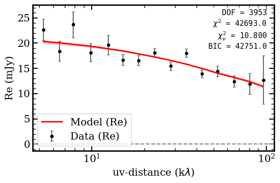
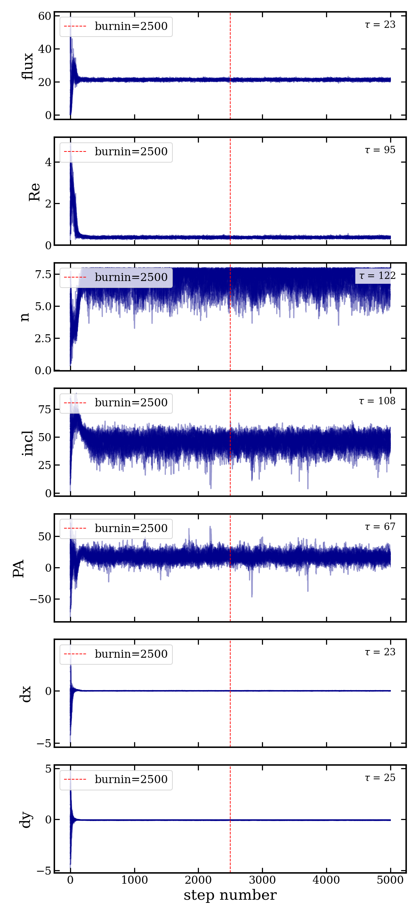
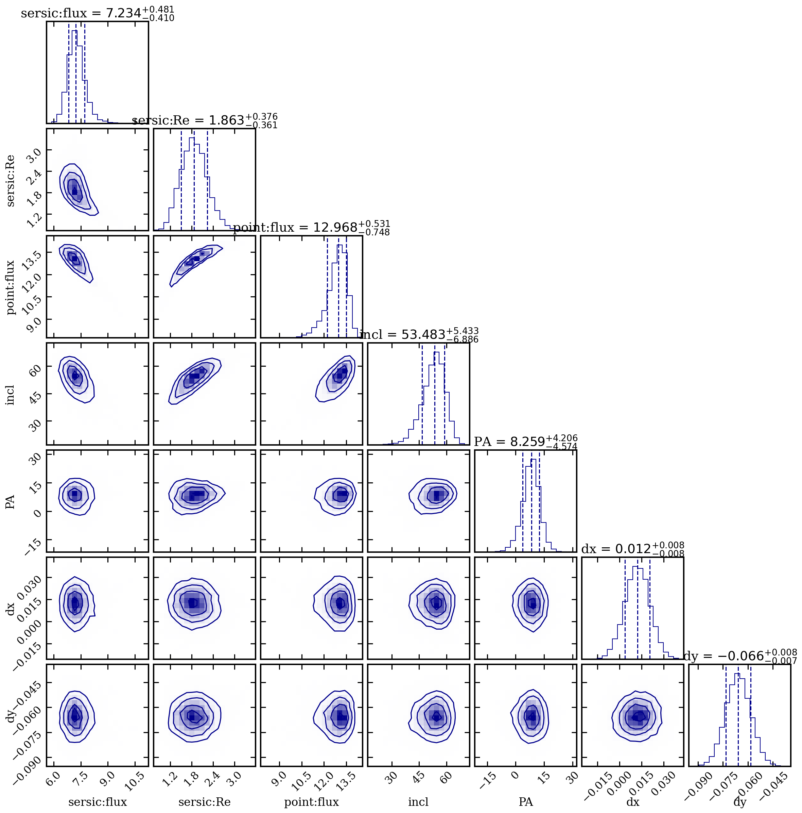

# Examples

This page walks through fitting real ALMA data with galfit-uv using two models:
a single free-n Sersic and a Sersic(n=1) + point source decomposition.

## Target

**GQC J0054-4955** observed in CO(3-2) at z ~ 2.5.

!!! note "Demo data"

    The measurement set can be downloaded from:
    <https://drive.google.com/file/d/1TPZQvP-7wc5Kk169Gh6IgiYAUoaug2bb/view?usp=sharing>

- 1980 visibility points after time-averaging
- UV range: 5 -- 111 kilo-lambda
- Wavelength: 2.817 mm
- Zero-baseline flux: ~19.2 mJy

Two models are compared:

| Model | Components | Free params |
|-------|-----------|-------------|
| **Model A** | Single Sersic (free n) | 7 |
| **Model B** | Sersic(n=1) + Point source | 7 (n fixed) |

## Step 1: Export Visibilities

Extract averaged visibility data from the measurement set.

```python
from galfit_uv.export import export_vis, save_uvtable

dvis, wle = export_vis('data/GQC_J0054-4955_avg.ms', verbose=True)

print(f"Extracted {len(dvis.u)} visibility points")
print(f"Wavelength: {wle*1e3:.3f} mm")
print(f"uv range: {dvis.uvdist.min()/1e3:.0f} -- {dvis.uvdist.max()/1e3:.0f} klambda")
print(f"Total flux (zero-baseline): {abs(dvis.vis[0])*1e3:.2f} mJy")

# Optionally save a uvplot-compatible table
save_uvtable(dvis.u, dvis.v, dvis.vis, dvis.wgt, 'uv_table.txt', wle=wle)
```

Output:

```
Extracted 1980 visibility points
Wavelength: 2.817 mm
uv range: 5 -- 111 klambda
Total flux (zero-baseline): 19.17 mJy
```

## Step 2: Build the Model

=== "Model A — Single Sersic"

    ```python
    from galfit_uv.models import make_model_fn

    model_fn, param_info = make_model_fn(['sersic'])
    # labels = ['flux', 'Re', 'n', 'incl', 'PA', 'dx', 'dy']
    ```

=== "Model B — Sersic(n=1) + Point"

    ```python
    from galfit_uv.models import make_model_fn

    model_fn, param_info = make_model_fn(
        ['sersic', 'point'],
        fixed={'sersic:n': 1.0},
    )
    # labels = ['sersic:flux', 'sersic:Re', 'point:flux', 'incl', 'PA', 'dx', 'dy']
    ```

## Step 3: Run MCMC

```python
from galfit_uv.fit import fit_mcmc

result = fit_mcmc(
    dvis, model_fn, param_info,
    max_steps=5000,
    burnin=2500,
    nwalk_factor=5,
    outpath='./fit_output',
    seed=42,
)
```

Settings: 35 walkers (7 free params x 5), 5000 steps per walker, 2500 burn-in steps.

Outputs saved to `outpath/`:

- `fit_results.fits` — multi-extension FITS with data, model, samples, fit statistics
- `chains.png` — walker traces with autocorrelation time annotations
- `corner_plot.png` — posterior corner plot

---

## Model A: Single Sersic (free n)

### Results

| Parameter | Best-fit | +1sig | -1sig |
|-----------|---------|-------|-------|
| flux (mJy) | 21.28 | +0.42 | -0.42 |
| Re (arcsec) | 0.365 | +0.03 | -0.03 |
| n | 7.38 | +0.45 | -0.77 |
| incl (deg) | 46.4 | +4.9 | -5.6 |
| PA (deg) | 16.6 | +5.7 | -5.7 |
| dx (arcsec) | 0.011 | +0.009 | -0.009 |
| dy (arcsec) | -0.067 | +0.008 | -0.008 |

**Fit statistics:** chi2/DOF = 10.80, BIC = 42751

The high Sersic index (n ~ 7.4, well above de Vaucouleurs n=4) indicates a very concentrated core with extended wings, while the small effective radius (Re ~ 0.37 arcsec) is consistent with a compact emission region.

### Figures

{ width="600" }

{ width="600" }

{ width="600" }

{ width="600" }

---

## Model B: Sersic(n=1) + Point Source

### Results

| Parameter | Best-fit | +1sig | -1sig |
|-----------|---------|-------|-------|
| sersic:flux (mJy) | 7.23 | +0.48 | -0.41 |
| sersic:Re (arcsec) | 1.86 | +0.38 | -0.36 |
| sersic:n | 1.00 | — | — (fixed) |
| point:flux (mJy) | 12.97 | +0.53 | -0.75 |
| incl (deg) | 53.5 | +5.4 | -6.9 |
| PA (deg) | 8.3 | +4.2 | -4.6 |
| dx (arcsec) | 0.012 | +0.008 | -0.009 |
| dy (arcsec) | -0.066 | +0.008 | -0.007 |

**Fit statistics:** chi2/DOF = 10.80, BIC = 42766

The model decomposes the source into an extended exponential disk (~7.2 mJy, Re ~ 1.86 arcsec) plus a dominant unresolved point source (~13 mJy), with a fitted inclination of ~53 degrees.

### Figures

{ width="600" }

{ width="600" }

{ width="600" }

{ width="600" }

---

## Model Comparison

| Metric | Model A (Sersic) | Model B (Sersic+Point) |
|--------|-------------------|------------------------|
| Total flux (mJy) | 21.3 | 7.2 + 13.0 = 20.2 |
| Extended size | Re = 0.37 arcsec | Re = 1.86 arcsec |
| Sersic index | n = 7.4 (free) | n = 1.0 (fixed) |
| BIC | 42751 | 42766 |

Both models yield nearly identical reduced chi-squared values. The single Sersic has a slightly lower BIC, but the two-component decomposition provides a more physically interpretable separation between an extended disk and a compact nucleus. The geometry parameters (center offset) are consistent between the two models.
