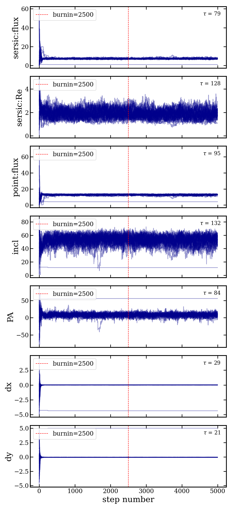
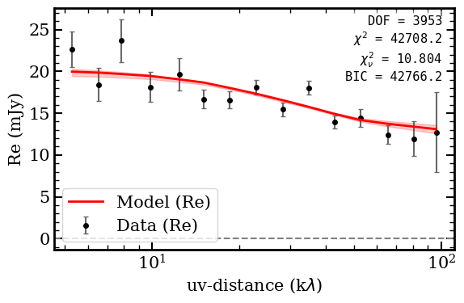
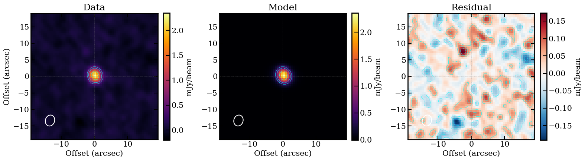

# galfit_uv Demo Report

Target: **GQC J0054-4955** (CO(3-2) line, z~2.5)
Model: Sersic(n=1) + Point source (tied geometry)

---

## 1. Package Overview

`galfit_uv` is a Python module for extracting ALMA visibility data from measurement sets and fitting parametric surface-brightness models via MCMC.

```
galfit_uv/
  __init__.py
  export.py      # Data extraction from MS
  models.py      # Surface-brightness profiles
  fit.py         # MCMC fitting with emcee
  plot.py        # UV plots and model-to-MS import
```

---

## 2. Data Export

### `export_vis(msfile, datacolumn='DATA', timebin=10.0, verbose=False)`

Reads a measurement set, handles variable-shape columns (via `tb.getvarcol`), averages polarizations, and returns a `Visibility` object with u,v in wavelengths.

```python
from galfit_uv.export import export_vis

dvis, wle = export_vis('target_avg.ms', timebin=10.0, verbose=True)
# dvis.u, dvis.v    — uv coordinates [wavelengths]
# dvis.vis          — complex visibility [Jy]
# dvis.wgt          — weights
# wle               — wavelength [m]
```

**Key features:**
- Transparently handles both variable and non-variable columns
- Averages polarizations using WEIGHT
- Converts uv from meters to wavelengths
- Filters flagged data
- Optional time binning (`timebin` parameter, in seconds) — averages per baseline per time bin, consistent with CASA `split(timebin='10s')`. Set to `None` or `0` to disable.

### `save_uvtable(u, v, vis, wgt, filename, wle=None)`

Saves data in uvplot-compatible ASCII format (COLUMNS_V0).

```python
from galfit_uv.export import save_uvtable
save_uvtable(dvis.u, dvis.v, dvis.vis, dvis.wgt, 'uv.txt', wle=wle)
```

**Demo data:** `data/GQC_J0054-4955_avg.ms` (bundled with the package, gitignored).

**Demo output:** `GQC_J0054-4955_uv.txt` (1980 points, regenerated at each run).

---

## 3. Building a Model

### `make_model_fn(profiles, tie_center=True, tie_incl=True, tie_pa=True, priors=None, fixed=None)`

Factory function that creates a combined visibility model with default priors, fixed-parameter support, and configurable geometry tying.

```python
from galfit_uv.models import make_model_fn

# Single Sersic
model_fn, param_info = make_model_fn(['sersic'])
# labels = ['flux', 'Re', 'n', 'incl', 'PA', 'dx', 'dy']

# Sersic + Point with fixed Sersic index
model_fn, param_info = make_model_fn(
    ['sersic', 'point'],
    fixed={'sersic:n': 1.0},
)
# labels = ['sersic:flux', 'sersic:Re', 'sersic:n', 'point:flux', 'incl', 'PA', 'dx', 'dy']
```

**Available profiles:**

| Profile    | Intrinsic parameters | Description |
|-----------|---------------------|-------------|
| `point`   | flux (mJy) | Unresolved source |
| `gaussian` | flux (mJy), sigma (arcsec) | Gaussian surface brightness |
| `sersic`  | flux (mJy), Re (arcsec), n | Generalized Sersic profile |

**Label format:** In multi-component models, intrinsic params are prefixed with `profile:` (e.g., `sersic:flux`), while tied shared params use bare names (e.g., `incl`).

**Default priors** (built in, overridable via `priors` dict):

| Parameter | Default range | Scale |
|-----------|--------------|-------|
| flux (mJy) | (0.1, 100) | log (Jeffreys) |
| Re (arcsec) | (0, 5) | linear |
| sigma (arcsec) | (0, 5) | linear |
| n | (0.3, 8) | linear |
| incl (deg) | (0, 90) | linear (+ sin prior) |
| PA (deg) | (-90, 90) | linear |
| dx (arcsec) | (-5, 5) | linear |
| dy (arcsec) | (-5, 5) | linear |

All visibility models use numerical Hankel (J1) transforms over 150 log-spaced radial bins.

---

## 4. MCMC Fitting

### `fit_mcmc(dvis, model_fn, param_info, p_init=None, ...)`

Runs emcee with chi-squared log-likelihood and priors configured by `make_model_fn`.

```python
from galfit_uv.fit import fit_mcmc

result = fit_mcmc(
    dvis, model_fn, param_info,
    max_steps=5000,
    burnin=2500,
    nwalk_factor=5,
    outpath='./fit_output_2comp',
    seed=42,
    n_workers=32,
)
```

No manual `p_ranges` or `p_lo`/`p_hi` arrays are needed — all prior configuration is handled by `make_model_fn`.

**Prior configuration printed at startup:**
```
Prior configuration:
    sersic:flux: [0.1, 100.0]  (log)
      sersic:Re: [0.0, 5.0]  (linear)
       sersic:n: fixed at 1.0
     point:flux: [0.1, 100.0]  (log)
           incl: [0.0, 90.0]  (linear)
             PA: [-90.0, 90.0]  (linear)
             dx: [-5.0, 5.0]  (linear)
             dy: [-5.0, 5.0]  (linear)
Fixed parameters (1): sersic:n = 1.0000
Free parameters (7): sersic:flux, sersic:Re, point:flux, incl, PA, dx, dy
```

**Prior types:**
- `log` scale: Jeffreys prior ($p(\theta) \propto 1/\theta$), walkers initialized in log-space
- `linear` scale: uniform prior (bounds only)
- `incl` params additionally get a $\sin(\mathrm{incl})$ prior

**Outputs saved to `outpath/`:**
- `fit_results.fits` — multi-extension FITS with data, model, best-fit params, samples, fit statistics
- `chains.png` — walker chains with autocorrelation time annotations
- `corner_plot.png` — posterior corner plot (free params only)

**Returns** an `MCMCResult` with:
- `result.bestfit` — median of posterior
- `result.samples` — flattened, burn-in-removed samples (all params including fixed)
- `result.all_samples` — full chain (n_steps, n_walkers, n_free_params)
- `result.free_labels` — labels of free params only
- `result.fixed` — `{label: value}` of fixed params
- `result.fit_stats` — `{chi2, dof, redchi2, bic, ndata, n_free}`

---

## 5. Diagnostic Plots

### Corner Plot (`corner_plot_2comp.png`)

Shows pairwise posterior distributions for all 7 free parameters (fixed parameter `sersic:n` is excluded). The 16/50/84 percentiles are displayed.


### Chain Plots (`chains_2comp.png`)

Single multi-panel figure (1 column, 7 parameter rows) showing all walker traces for the free parameters. The red dashed line marks the burn-in cutoff. The integrated autocorrelation time $\tau$ is annotated for each parameter.



---

## 6. UV Visualization

### UV Plot (`uvplot_2comp.png`)

Binned real-part visibility vs. UV distance (log x-axis) with 16-84% credible region from 100 posterior samples and fit statistics annotation.



---

## 7. Clean Imaging

### `clean_image(msfile, u, v, mvis, wle, ...)`

Runs CASA `tclean` on the data, model, and residual measurement sets.

**Beam:** 3.360" x 2.774", PA=72.5 deg



---

## 8. Demo Results

Best-fit parameters for GQC J0054-4955 with Sersic(n=1) + Point source model:

| Parameter | Best-fit | +1sig | -1sig |
|-----------|---------|-------|-------|
| sersic:flux (mJy) | 7.23 | +0.48 | -0.41 |
| sersic:Re (arcsec) | 1.86 | +0.38 | -0.36 |
| sersic:n | 1.00 | — | — (fixed) |
| point:flux (mJy) | 12.97 | +0.53 | -0.75 |
| incl (deg) | 53.48 | +5.43 | -6.88 |
| PA (deg) | 8.26 | +4.21 | -4.57 |
| dx (arcsec) | 0.012 | +0.008 | -0.009 |
| dy (arcsec) | -0.066 | +0.008 | -0.007 |

**Fit statistics:** chi^2 = 42708.2, DOF = 3953, red-chi^2 = 10.804, BIC = 42766.2

The model shows a partially resolved exponential disk (~1.9 arcsec effective radius) contributing ~7.2 mJy, with a dominant unresolved point source of ~13 mJy. The fitted inclination of ~53 degrees suggests the source is moderately inclined.
