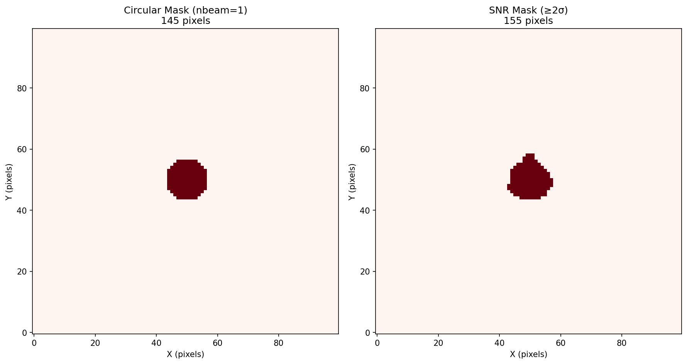
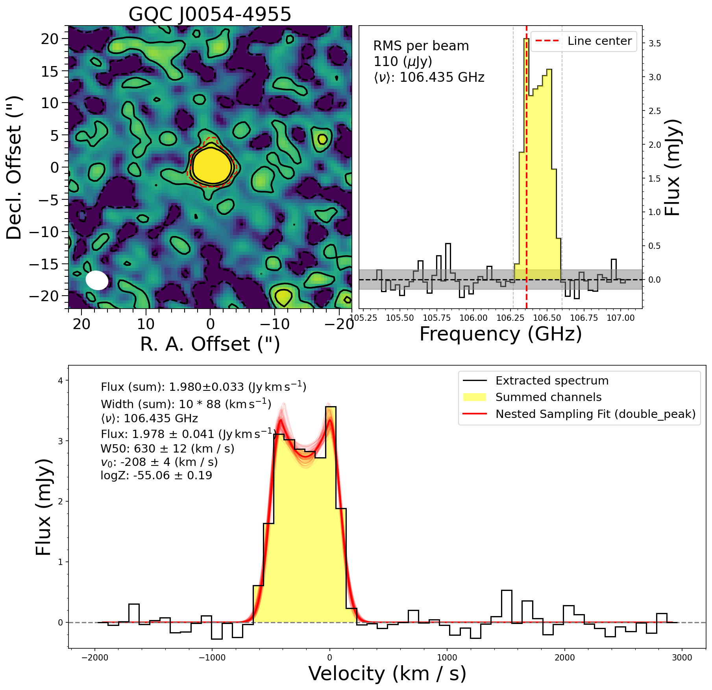
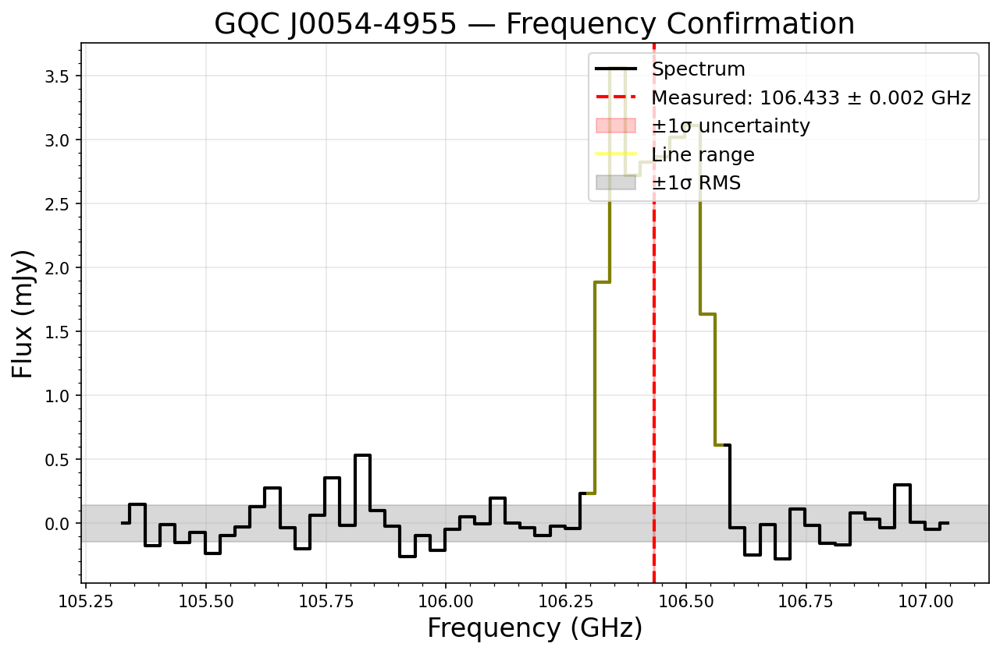
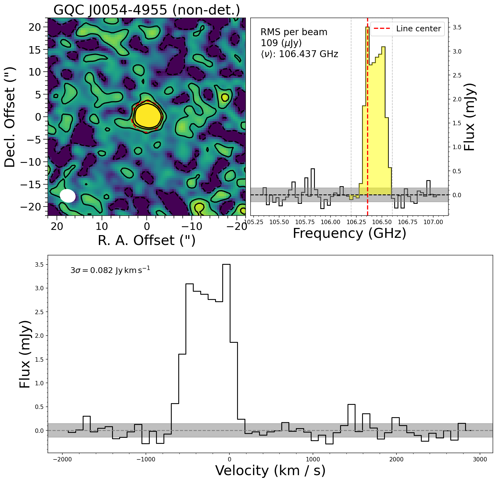

# galfit_uv Demo Report — Cube Measurement Pipeline

Target: **GQC J0054-4955** (CO(3-2) line, z = 2.2512)
Model: Gaussian Double Peak (Tiley et al. 2016)

---

## 1. Overview

The `galfit_uv.measure` module provides a pipeline for measuring emission line
properties from ALMA spectral line cubes:

1. **Source masking** — circular aperture or SNR-threshold masks
2. **Spectrum extraction** — integrated spectrum from masked region
3. **Line detection** — moment-0 map, spectral plot, and RMS estimation
4. **Line profile fitting** — nested sampling with dynesty (Gaussian, DoublePeak, or asymmetric DoublePeak)
5. **Non-detection upper limits** — 3-sigma flux limits for undetected lines

```python
from galfit_uv.measure import (
    quick_measure, detect_source, source_mask, source_mask_snr,
    extract_spectrum, fit_dynesty, calculate_w50,
    compare_source_masks, plot_detection, plot_nondetection,
    Plot_Map, Plot_Beam, plot_1d_spectrum,
)
```

**Optional dependencies:** `spectral-cube`, `dynesty` (install via `pip install galfit-uv[measure]`).

---

## 2. Data

The cube is a primary-beam-corrected line image from ALMA Band 3:

| Property | Value |
|----------|-------|
| File | `GQC_J0054-4955_co32_init_line_freq.image.pbcor.fits` |
| Shape | 56 channels x 100 x 100 pixels |
| Spectral range | 105.33 -- 107.04 GHz |
| Channel width | 31.3 MHz (~88 km/s) |
| Beam | 3.46" x 2.86", PA = 72 deg |
| Rest frequency | 345.796 GHz (CO J=3-2) |
| Predicted line freq | 106.36 GHz (at z = 2.2512) |

Load the cube with `spectral_cube`:

```python
from spectral_cube import SpectralCube

cube = SpectralCube.read('data/GQC_J0054-4955_co32_init_line_freq.image.pbcor.fits')
```

---

## 3. Source Masking

Two masking methods are available:

- **Circular aperture** (`source_mask`): mask pixels within `nbeam` beam widths of the phase center. Simple and robust, suitable for non-detections.
- **SNR threshold** (`source_mask_snr`): mask pixels above `nsigma` times the background RMS in a moment-0 map, keeping only connected segments whose centroid falls within a circular aperture. Better for extended or asymmetric emission.

The `compare_source_masks` function generates a side-by-side comparison:

```python
fig, masks = compare_source_masks(
    cube, nbeam=1, nsigma=2,
    freq_range=[106.27, 106.6],  # GHz, channels with line emission
)
```



For GQC J0054-4955, both masks cover a similar area (~145-155 pixels). The SNR
mask adapts to the actual emission morphology, while the circular mask is a fixed
aperture.

---

## 4. Detection and Line Profile Fitting

The `quick_measure` function runs the full pipeline: masking, extraction, moment-0
map visualization, spectrum plot, and optional line profile fitting.

```python
from galfit_uv.measure import quick_measure
import astropy.units as u

res = quick_measure(
    cube,
    freq_line=106.36 * u.GHz,       # predicted line frequency
    freq_range=[106.27, 106.6],      # GHz, for SNR mask and spectrum extraction
    mask_method='snr',              # or 'circular'
    nsigma=2,
    field_radius=22,                # arcsec
    title='GQC J0054-4955',
    detect=True,
    fit=True,
    fit_model='double_peak',        # Gaussian, double_peak, or double_peak_asym
    nlive=500,
    dlogz=0.01,
)
```

The output is a 3-panel figure with the moment-0 map (top-left), extracted spectrum (top-right), and the detection/fit plot (bottom):



### Fitting results

The Double Peak model (Tiley et al. 2016, MNRAS, 461, 3494) describes a
double-horn profile with a central depression, characteristic of rotating disk
emission:

$$S(v) = \begin{cases}
S_\mathrm{peak} \exp\left[-\frac{(v - v_c + w)^2}{2\sigma^2}\right] & v < v_c - w \\
S_c + \frac{S_\mathrm{peak} - S_c}{w^2}(v - v_0)^2 & v_c - w \le v \le v_c + w \\
S_\mathrm{peak} \exp\left[-\frac{(v - v_c - w)^2}{2\sigma^2}\right] & v > v_c + w
\end{cases}$$

| Parameter | Value |
|-----------|-------|
| Integrated flux (sum) | 1.98 Jy km/s |
| Integrated flux (fit) | 1.98 ± 0.04 Jy km/s |
| W50 (line width) | 630 ± 12 km/s |
| Velocity center | -208 ± 4 km/s |
| RMS | 0.144 mJy |
| log Z (evidence) | -150.92 |

The summed and fitted fluxes are fully consistent, indicating the Double Peak
model provides a good description of the line profile.

### Frequency confirmation

From the fitted velocity center, the measured line frequency and redshift are:

| Quantity | Value |
|----------|-------|
| Predicted freq | 106.360 GHz |
| Measured freq | 106.433 ± 0.002 GHz |
| Input redshift | 2.2512 |
| Measured redshift | 2.24895 ± 0.00005 |

The ~200 km/s offset from the predicted frequency corresponds to a redshift
difference of ~0.002, consistent with typical uncertainties in optical
spectroscopic redshifts.



---

## 5. Non-detection Upper Limits

For sources without a detected line, `quick_measure` with `detect=False` computes
a 3-sigma upper limit on the integrated flux:

```python
res = quick_measure(
    cube,
    freq_line=106.36 * u.GHz,
    mask_method='circular',
    nbeam=1,
    detect=False,
    vrange=400 * u.km / u.s,  # assumed line width
)
```

The upper limit is calculated as:

$$S_\mathrm{up} = n_\sigma \cdot \mathrm{RMS} \cdot \sqrt{\Delta v \cdot \delta v}$$

where $\Delta v$ is the assumed velocity range and $\delta v$ is the channel width.

For this cube (using a circular mask, 1 beam, 400 km/s range):

| Quantity | Value |
|----------|-------|
| 3-sigma upper limit | 0.082 Jy km/s |



---

## 6. Available Line Profile Models

Three models are available via the `fit_model` parameter:

| Model | Parameters | Description |
|-------|-----------|-------------|
| `gaussian` | `a, b, c` (amp, center, sigma) | Simple Gaussian profile |
| `double_peak` | `ag, ac, v0, sigma, w` | Symmetric double-horn (Tiley+ 2016) |
| `double_peak_asym` | `ag_left, ag_right, ac, v0, sigma, w_left, w_right` | Asymmetric double-horn |

All models are defined in `galfit_uv.lineprofiles` and can also be used
standalone:

```python
from galfit_uv.lineprofiles import Gaussian, Gaussian_DoublePeak
import numpy as np

x = np.linspace(-500, 500, 1000)  # velocity axis
y = Gaussian_DoublePeak(x, ag=2.0, ac=0.5, v0=0, sigma=150, w=80)
```

---

## 7. File Inventory

```
demo/
  data/
    GQC_J0054-4955_co32_init_line_freq.image.pbcor.fits  # Cube (gitignored)
  run_demo_measure.py                                     # Demo script
  figs/
    measure_mask_comparison.png     # Circular vs SNR mask comparison
    measure_quick_detection.png     # Detection + DoublePeak fit (3-panel)
    measure_freq_confirmation.png   # Measured frequency confirmation
    measure_nondetection.png        # Non-detection upper limit example
```
