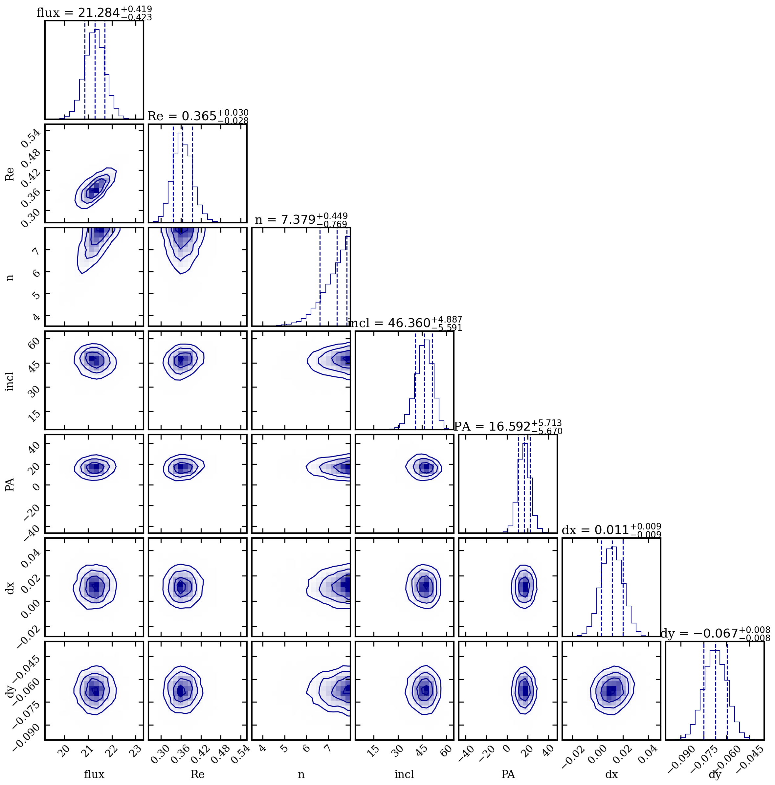
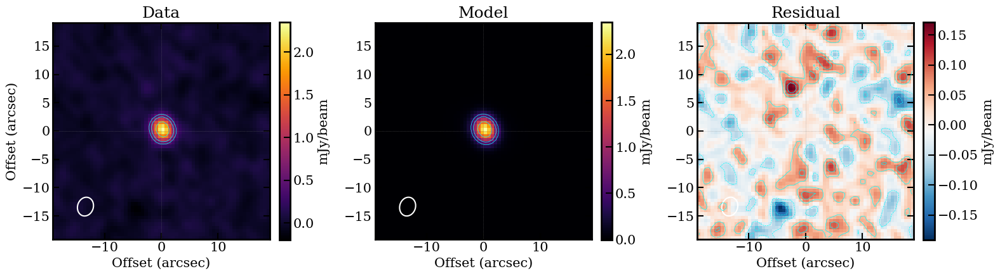

# galfit_uv Demo Report — Sersic Model

Target: **GQC J0054-4955** (CO(3-2) line, z~2.5)
Model: Single Sersic profile

---

## 1. Package Overview

`galfit_uv` is a Python module for extracting ALMA visibility data from measurement sets and fitting parametric surface-brightness models via MCMC.

```
galfit_uv/
  __init__.py
  export.py      # Data extraction from MS
  models.py      # Surface-brightness profiles
  fit.py         # MCMC fitting with emcee
  plot.py        # UV plots and model-to-MS import
```

---

## 2. Data Export

### `export_vis(msfile, datacolumn='DATA', timebin=10.0, verbose=False)`

Reads a measurement set, handles variable-shape columns (via `tb.getvarcol`), averages polarizations, and returns a `Visibility` object with u,v in wavelengths.

```python
from galfit_uv.export import export_vis

dvis, wle = export_vis('target_avg.ms', timebin=10.0, verbose=True)
# dvis.u, dvis.v    — uv coordinates [wavelengths]
# dvis.vis          — complex visibility [Jy]
# dvis.wgt          — weights
# wle               — wavelength [m]
```

**Demo data:** `data/GQC_J0054-4955_avg.ms` (bundled with the package, gitignored).

**Demo output:** `GQC_J0054-4955_uv.txt` (1980 points, uv range 5--111 klambda, wavelength 2.817 mm; regenerated at each run).

---

## 3. Model Setup

This demo uses a single Sersic profile.  Default priors are built into `make_model_fn`:

```python
from galfit_uv.models import make_model_fn

model_fn, param_info = make_model_fn(['sersic'])
# param_info['n_params'] = 7
# param_info['labels'] = ['flux', 'Re', 'n', 'incl', 'PA', 'dx', 'dy']
```

The Sersic profile is a generalized surface-brightness distribution:

$$I(R) = I_e \exp\left\{-b_n\left[\left(\frac{R}{R_e}\right)^{1/n} - 1\right]\right\}$$

where $b_n \approx 2n - 1/3 + 4/(405n)$ and $R_e$ is the effective (half-light) radius. A Gaussian corresponds to $n = 0.5$, while a de Vaucouleurs profile has $n = 4$.

**Default priors:**

| Parameter | Description | Default range | Scale |
|-----------|-------------|---------------|-------|
| flux (mJy) | Total integrated flux | (0.1, 100) | log (Jeffreys) |
| Re (arcsec) | Effective radius | (0, 5) | linear |
| n | Sersic index | (0.3, 8) | linear |
| incl (deg) | Inclination | (0, 90) | linear (+ sin prior) |
| PA (deg) | Position angle | (-90, 90) | linear |
| dx (arcsec) | Offset x | (-5, 5) | linear |
| dy (arcsec) | Offset y | (-5, 5) | linear |

---

## 4. MCMC Fitting

```python
from galfit_uv.fit import fit_mcmc

result = fit_mcmc(
    dvis, model_fn, param_info,
    max_steps=5000,
    burnin=2500,
    nwalk_factor=5,
    outpath='./fit_output_sersic',
    seed=42,
    n_workers=32,
)
```

No manual `p_ranges` or `p_lo`/`p_hi` arrays are needed — all prior configuration is handled by `make_model_fn`.

**MCMC settings:** 35 walkers (7 free params x 5), 5000 steps, 2500 burn-in. Total flux ~19.2 mJy from zero-baseline visibility.

**Prior configuration printed at startup:**
```
Prior configuration:
    flux: [0.1, 100.0]  (log)
      Re: [0.0, 5.0]  (linear)
       n: [0.3, 8.0]  (linear)
    incl: [0.0, 90.0]  (linear)
      PA: [-90.0, 90.0]  (linear)
      dx: [-5.0, 5.0]  (linear)
      dy: [-5.0, 5.0]  (linear)
```

**Outputs saved to `outpath/`:**
- `fit_results.fits` — multi-extension FITS with data, model, best-fit params, samples, fit statistics
- `chains.png` — walker chains with autocorrelation time annotations
- `corner_plot.png` — posterior corner plot

---

## 5. Diagnostic Plots

### Corner Plot (`corner_plot_sersic.png`)

Shows pairwise posterior distributions for all 7 free parameters.



### Chain Plots (`chains_sersic.png`)

Multi-panel walker traces with burn-in cutoff and integrated autocorrelation time $\tau$.


---

## 6. UV Visualization

### UV Plot (`uvplot_sersic.png`)

Binned real-part visibility vs. UV distance (log x-axis) with 16-84% credible region from 100 posterior samples and fit statistics annotation.


---

## 7. Clean Imaging

### `clean_image(msfile, u, v, mvis, wle, ...)`

Runs CASA `tclean` on the data, model, and residual measurement sets.

**Beam:** 3.360" x 2.774", PA=72.5 deg



---

## 8. Demo Results

Best-fit parameters for GQC J0054-4955 with a single Sersic model:

| Parameter | Best-fit | +1sig | -1sig |
|-----------|---------|-------|-------|
| flux (mJy) | 21.28 | +0.42 | -0.42 |
| Re (arcsec) | 0.365 | +0.03 | -0.03 |
| n | 7.38 | +0.45 | -0.77 |
| incl (deg) | 46.36 | +4.89 | -5.59 |
| PA (deg) | 16.59 | +5.71 | -5.67 |
| dx (arcsec) | 0.011 | +0.009 | -0.009 |
| dy (arcsec) | -0.067 | +0.008 | -0.008 |

**Fit statistics:** chi^2 = 42693.0, DOF = 3953, red-chi^2 = 10.800, BIC = 42751.0

### Interpretation

The Sersic index is high ($n \approx 7.4$), well above the de Vaucouleurs value of 4, indicating a very concentrated core with extended wings. The effective radius is small ($R_e \approx 0.37$ arcsec), consistent with a compact emission region. The total flux (21.3 mJy) is slightly higher than the zero-baseline flux (19.2 mJy), suggesting the model captures nearly all the flux in the source.

### Comparison with Sersic(n=1) + Point Source Model

| Metric | Sersic | Sersic(n=1)+Point |
|--------|--------|-------------------|
| Total flux (mJy) | 21.3 | 7.2 + 13.0 = 20.2 |
| Extended component size | Re = 0.37" | Re = 1.86" |
| Sersic index | n = 7.4 (free) | n = 1.0 (fixed) |
| Inclination (deg) | 46.4 | 53.5 |
| PA (deg) | 16.6 | 8.3 |
| Center offset (dx, dy) | (0.011, -0.067) | (0.012, -0.066) |

The geometry parameters (center offset) are nearly identical between the two models. The main difference is in the flux distribution: the 2-comp model decomposes the source into an extended exponential disk (~7.2 mJy, Re=1.86") plus a dominant point source (~13 mJy), while the free-n Sersic model describes it as a single very concentrated profile (n~7.4, Re~0.37") with total flux ~21 mJy.

---

## 9. File Inventory

```
demo/
  data/
    GQC_J0054-4955_avg.ms  # Measurement set (gitignored)
  run_demo_sersic.py    # Sersic demo script
  GQC_J0054-4955_uv.txt # Exported uv-table (gitignored, regenerated)
  fit_output_sersic/    # MCMC output (gitignored)
    fit_results.fits
    chains.png
    corner_plot.png
  figs/
    uvplot_sersic.png
    corner_plot_sersic.png
    chains_sersic.png
    clean_images_sersic.png
  clean_output_sersic/ # tclean output (gitignored)
```
